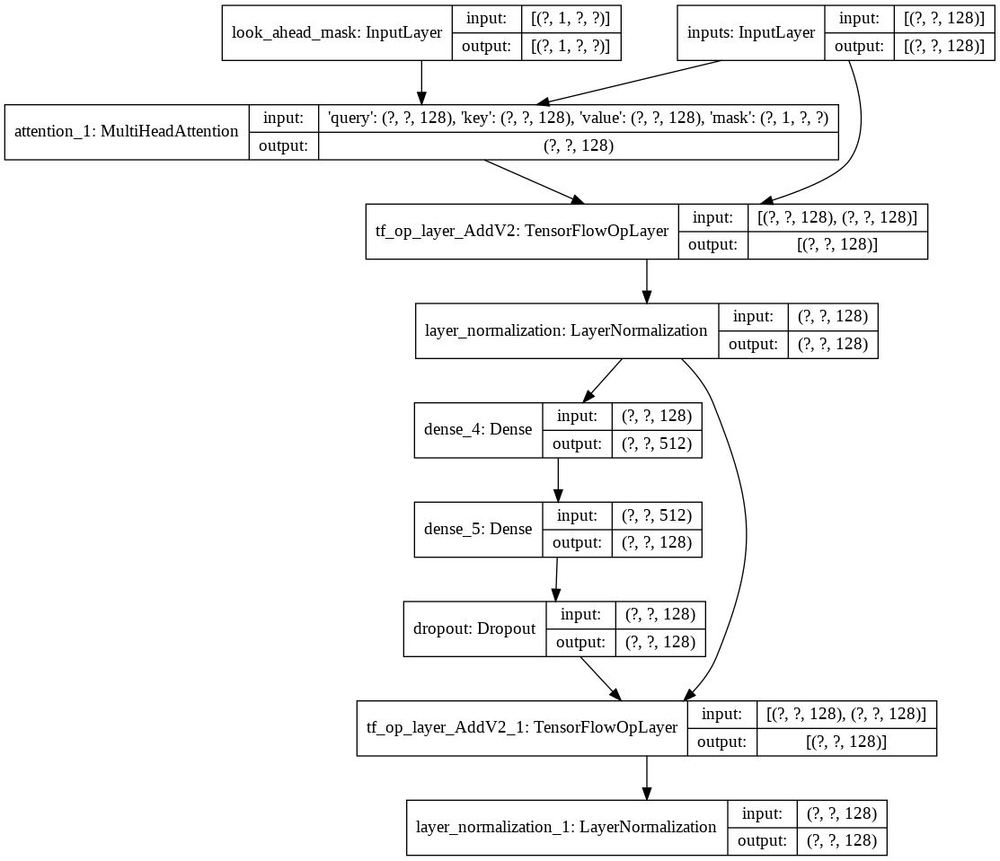
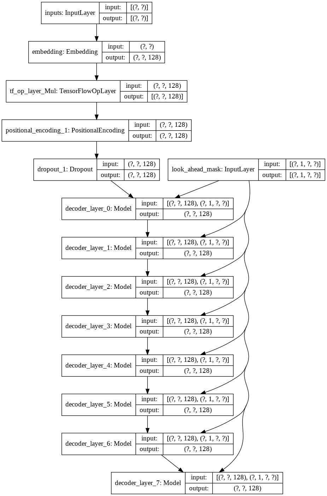
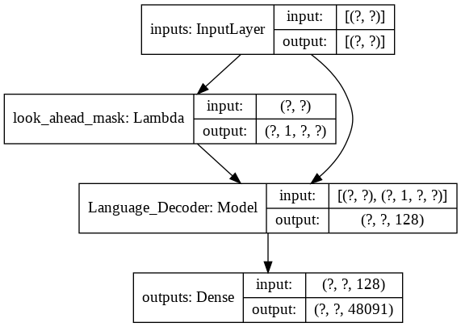

# Short Joke Generator

In this project I have trained a transformer model to generate short jokes. Then with a slight modification of the inference method I was able to use the same model such that given an initial string as input the model tries to complete it in a humourous way. 

There are two notebooks both doing the same task. 

 - In *Joke Generation.ipynb* I have used the pretrained HuggingFace library's GPT2-LM model and we only fine tune this model on the jokes dataset. Since we are using transfer learning and are fine tuning the weights it takes only around 4 epochs to get good results.
 
 - In *Joke_Completion_Pure_TF2_Implementation.ipynb* I have created the complete transformer model from scratch. Since it begins with random initial weights it takes around 10 epochs to get decent result from this model. 
 
 
### Data

For our task we will use the dataset provided on [Kaggle]( https://www.kaggle.com/abhinavmoudgil95/short-jokes). It is a csv containing over 200000 Short Jokes scrapped from Reddit. 

**Note :** Since the dataset is simply scrapped from various subreddits, a large number of the jokes in the dataset are quite racist and sexist. Since, any AI assumes its training data as single source of knowledge, it should be expected that sometimes our model will generate similar jokes.
 
### Pre-Processing:
Once we have tokenized our joke string we add a `start_token` and an `end_token` at the ends of the tokenized list. Also, since our joke string could be of different length we also apply padding in all the strings to a specified `max_length` so that the all the tensors are of similar shape in our batches.
 
## Short Joke Generator - Using GPT2-LM Head model
Code for this can be found in the notebook `Joke Generation.ipynb`. In this we will import the GPT2Tokenizer and TFGPT2LMHead Model from HuggingFace library. The code is written in Tensorflow2. The notebook has comments providing explanation for the code at suitable places. Also, the HuggingFace Docs provides good documentation of what are the input params and return value of the model.
 
## Short Joke Generator - Building from scratch using TF2 API
Code for this can be found in the notebook `Joke_Completion_Pure_TF2_Implementation.ipynb`. Taking the project a step further for deeper understanding of how things are working I tried to build a transformer with no external library. I have referred to the tutorial for Transformers provided by Tensorflow and have put some of the explanations mentioned in their tutorial in my notebook with futher explanation so that it is easy to understand what is going on. 

I first built a tokenizer for our dataset and tokenized the strings using it. Then, built a layer for `Positional Encodings` and `MultiHeadAttention`. Also, I used a `Lambda layer` for creating the suitable masks for our data. 

Then I created on building a single `decoder layer` for our decoder. The following is the architecture of a single decoder layer.

Once we have the function providing a `decoder layer` ready I built a function `decoder` that accepts a the input tokens and mask as input, along with a param of number of layer of decoder we need and return a model for the same. For our task we will be using a language decoder with 8 decoder layers. The following is the architecture of the decoder.

For the final `transformer` model it takes the input tokens, pass it through the lamda layer to get the mask and pass both the mask and tokens to our Language Decoder. Following is the architecture of our final model.

